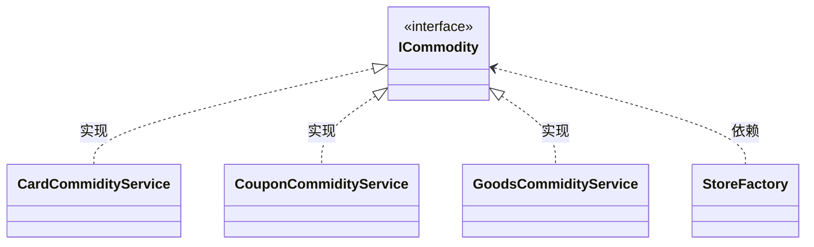

+++
title = "创建型-工厂模式"
date = "2023-02-28"

+++

# 创建型-工厂模式

工厂模式又称为简单工厂模式，属于创建型设计模式的一种。

这种设计模式提供了按需创建对象的最佳方式。不会对外暴露创建细节，并且会通过一个统一的接口创建所需的对象。

它主要的意图是定义一个创建对象的接口，让其子类自己决定将哪一个工厂类实例化，工厂模式使创建过程延迟到子类中进行。


### 场景模拟

模拟发放多种奖品，在营销场景中，经常会约定在用户完成打卡、分享、留言、邀请注册等一系列行为操作后进行返利积分的操作。用户再通过返利积分兑换奖品，让整个系统构成一个生态闭环。

现假设有以下三种类型的商品接口。

```java
// 优惠券
CouponResult sendCoupon(String uId, String couponNumber, String uuid);

// 实物商品
Boolean deliverGoods(DeliverReq req);

// 第三方兑换卡
void grantToken(String bindMobileNumber, String cardId);
```

三个接口返回值类型不同，入参不同，并且未来可能会扩展的兑换场景。


### 最初设计

工程结构

```java
├─AwardReq.java
├─AwardRes.java
└─PrizeController.java
```

实现

```java
public class PrizeController{
  public AwardRes awardToUser(AwardReq req){
    if(req.type == "优惠券"){
      // do something
      CouponResult result = sendCoupon(req.uId,req.conponNumber,req.uuid);
      return AwardRes(result);
    }else if(req.type == "实物"){
      DelilverReq deliverReq = new DeliverReq();
      // do something
      Boolean result = deliverGoods(deliverReq);
      return AwardRes(result);
    }else if(req.type == "第三方兑换卡"){
      grantToken(req.bindMobileNumber,req.cardId);
      return AwardRes(true);
    }
  }
}
```

不利于扩展，难以维护。


### 重构代码

工程结构

```java
├─store
│ ├─imple
│ │ ├─CardCommodityService.java
│ │ ├─CouponCommodityService.java
│ │ └─GoodsCommodityService.java
│ └─Icommodity.java
└─StoreFactory.java
```


